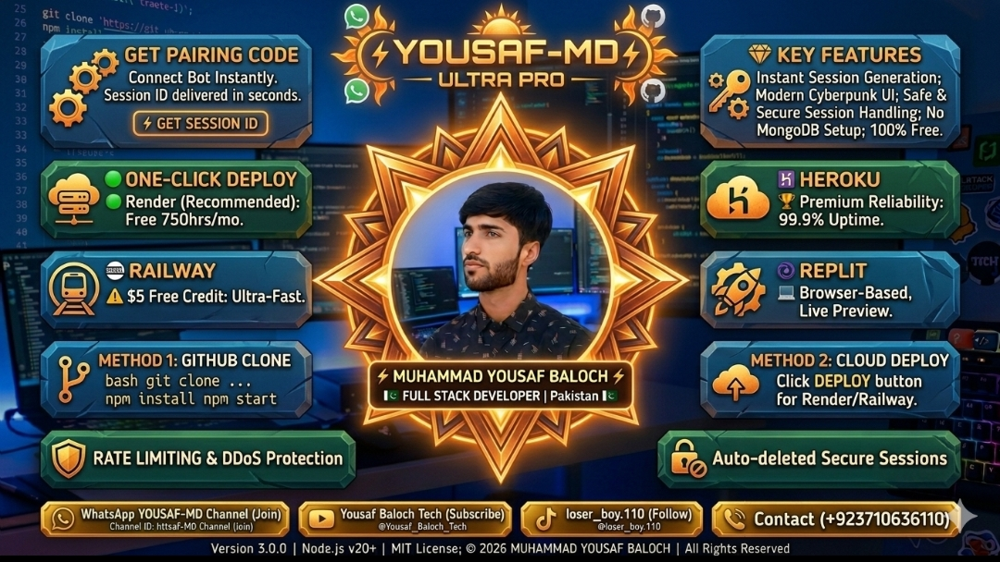

 

 

 

 

 

  
  
  
  

 

 

 

 

##  WELCOME TO YOUSAF-MD 

 

 

  
  
  

 

---

##  BOT FEATURES 

 

<table align="center" style="border-collapse: separate; border-spacing: 0; border-radius: 15px; overflow: hidden;">
  <thead>
    <tr style="background: linear-gradient(90deg, #FF0080, #7928CA, #FF0080);">
      <th style="padding: 15px; color: #FFD700; font-size: 18px;">🎯 CATEGORY</th>
      <th style="padding: 15px; color: #00FF00; font-size: 18px;">✨ FEATURES</th>
      <th style="padding: 15px; color: #00FFFF; font-size: 18px;">📊 STATUS</th>
    </tr>
  </thead>
  <tbody>
    <tr style="background: #1a1a2e;">
      <td></td>
      <td><b>GPT, Llama, Mistral, Image Generation (Flux/DALL-E)</b></td>
      <td></td>
    </tr>
    <tr style="background: #16213e;">
      <td></td>
      <td><b>YouTube, TikTok, Instagram, Facebook, Spotify, MediaFire</b></td>
      <td></td>
    </tr>
    <tr style="background: #1a1a2e;">
      <td></td>
      <td><b>Photo to Sticker, Video to Sticker, Steal Sticker</b></td>
      <td></td>
    </tr>
    <tr style="background: #16213e;">
      <td></td>
      <td><b>TagAll, Kick, Add, Promote, Demote, AntiLink, Welcome</b></td>
      <td></td>
    </tr>
    <tr style="background: #1a1a2e;">
      <td></td>
      <td><b>Auto View Status, Anti-Delete, Auto Reply, Auto Read</b></td>
      <td></td>
    </tr>
    <tr style="background: #16213e;">
      <td></td>
      <td><b>Jokes, Memes, Truth/Dare, Hangman, TicTacToe, Trivia</b></td>
      <td></td>
    </tr>
    <tr style="background: #1a1a2e;">
      <td></td>
      <td><b>Google Image, Wikipedia, Weather, IMDb, News</b></td>
      <td></td>
    </tr>
    <tr style="background: #16213e;">
      <td></td>
      <td><b>Play, Song, Lyrics, TTS Voice, Spotify Search</b></td>
      <td></td>
    </tr>
    <tr style="background: #1a1a2e;">
      <td></td>
      <td><b>Anti-Badword, Anti-Spam, Anti-Tag, Warn System</b></td>
      <td></td>
    </tr>
    <tr style="background: #16213e;">
      <td></td>
      <td><b>Full Admin Control Panel, Sudo System, Mode Toggle</b></td>
      <td></td>
    </tr>
  </tbody>
</table>

 

<h2>
  
  📈 260+ PREMIUM COMMANDS AVAILABLE! 📈
  
</h2>

 

---

##  DEVELOPER 

 

 

  

<table align="center">
  <tr>
    <td align="center" width="200">
      
       
      <b>Contact: +92 371 0636110</b>
    </td>
    <td align="center" width="200">
      
       
      <b>@yousafpubg110-tech</b>
    </td>
  </tr>
</table>

 

 

##  SOCIAL MEDIA LINKS 

 

<table align="center">
  <tr>
    <td align="center">
      
        
      
       
      <b>🎬 Subscribe to YouTube Channel</b>
       
      
Detailed video tutorials available on my official channel!

       
      
    </td>
  </tr>
  <tr>
    <td align="center">
      
        
      
       
      <b>📢 Join WhatsApp Channel</b>
       
      
Official updates and bot announcements!

    </td>
  </tr>
  <tr>
    <td align="center">
      
        
      
       
      <b>🎵 Follow on TikTok: @loser_boy.110</b>
    </td>
  </tr>
</table>

 

---

##  DEPLOY YOUR BOT 

 

> # ⭐ STEP 1 — STAR THIS REPO FIRST ⭐
> ### Please click the ⭐ Star button at the top of this page BEFORE forking or deploying. It helps the project grow and keeps you updated on new releases!

  

 

> # 🍴 STEP 2 — FORK THE REPO
> ### Click Fork so you have your own copy under your GitHub account.

  

 

> # 🚀 STEP 3 — DEPLOY ON ANY PLATFORM BELOW
> ### Deploy WITHOUT pairing — the pairing page appears automatically after deploy completes.

<table align="center">
  <tr>
    <td align="center">
      
       
      
    </td>
    <td align="center">
      
       
      
    </td>
  </tr>
  <tr>
    <td align="center">
      
       
      
    </td>
    <td align="center">
      
       
      
    </td>
  </tr>
  <tr>
    <td align="center">
      
       
      
    </td>
    <td align="center">
      
       
      
    </td>
  </tr>
</table>

 

 

##  GET YOUR PAIRING CODE 

 

  

 

### ⚡ QUICK STEPS TO GET YOUR PAIRING CODE:

1️⃣ Wait for your deployment to finish (Heroku/Railway/Koyeb/Render/VPS)  
2️⃣ Open `https://YOUR-APP-URL/pair` in any browser  
3️⃣ Enter your WhatsApp number  
4️⃣ Get the pairing code instantly on screen  
5️⃣ WhatsApp → Linked Devices → Link with phone number  
6️⃣ Enter the code — bot connects and starts automatically ✅

> 💡 Example: if your app URL is `https://yousaf-md.onrender.com`, your pairing page is `https://yousaf-md.onrender.com/pair`

 

---

##  GITHUB STATISTICS 

 

 

 

---

##  WHY CHOOSE YOUSAF-MD? 

 

 

<table align="center">
  <tr>
    <td align="center">
      
    </td>
    <td align="center">
      
    </td>
  </tr>
</table>

<h3>💝 Support This Project:</h3>

If you like this project, please give it a ⭐ star on GitHub!

---

##  LICENSE & CREDITS 

This project is licensed under a <b>Permanent Proprietary License</b> 
Free to deploy and use — original ownership and credit stay with Muhammad Yousaf Baloch, always.

<h3>👨‍💻 Special Credits:</h3>

 

<table align="center">
  <tr>
    <td align="center">
      
        
      <b>Muhammad Yousaf Baloch</b>
       
      Lead Developer & Owner
    </td>
    <td align="center">
      
        
      <b>All Contributors</b>
       
      Community Support
    </td>
  </tr>
</table>

 

 

 

